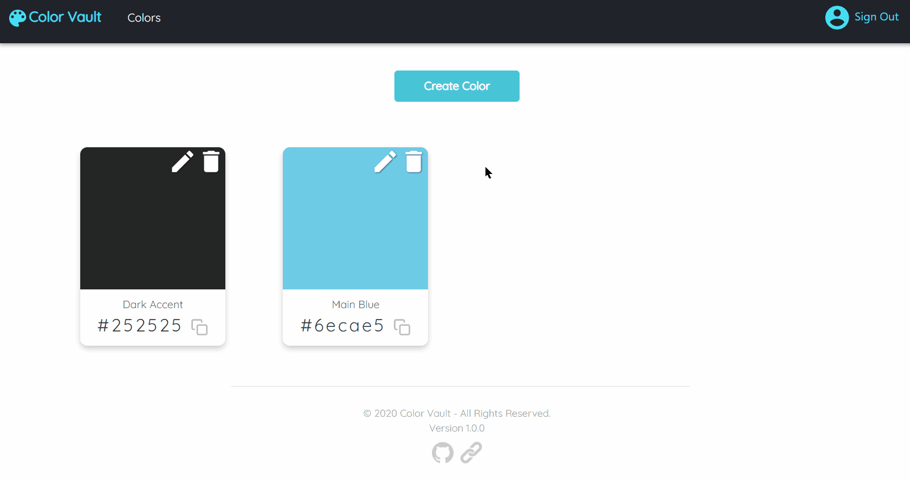

# Color Vault

Color Vault is a storage solution for digital color codes while also providing an easy copy-to-clipboard
feature allowing instant usage of your colors in digital media or web design projects.

[Visit Color Vault](https://thecolorvault.herokuapp.com/)

[View the server repository](https://github.com/Chase00/ColorVaultAPI)

## Demo

